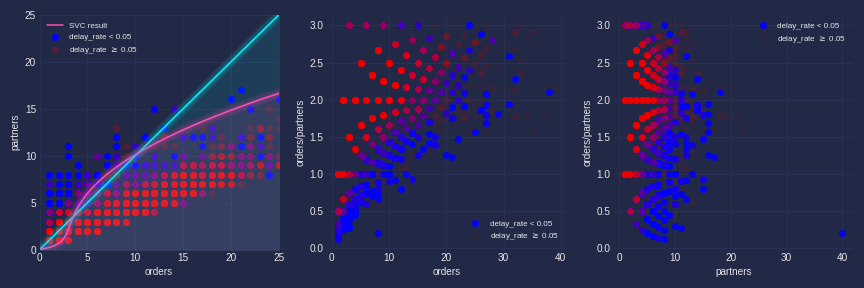
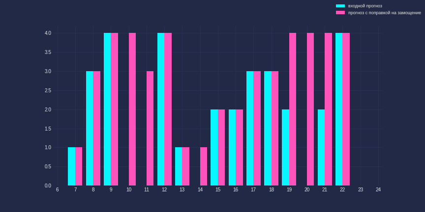

# hackaton_cmf

## Предсказание числа заказов

Сначала мы поработали с таблицей - добавили недостающие часы и даты, чтобы не было пропусков. (теперь предсказания могут содержать нули!). Предварительно мы посмотрели, в какие часы поступают заказы - выяснилось, что промежуток 7-23 часа оптимален.
Затем мы добавили признаки. Так как обучение идет на ноябре, в котором всего крупный один праздник (день народного единства), а для первой недели декабря (для которой предсказываем) еще далеко до нового года, мы решили не добавлять признаки, связанные с праздниками, и ограничились добавлением дней недели и также перевели зоны доставки я колонки (потому что эти зоны - категориальные признаки в диапазоне от 0 до 592, и так их оставлять не есть хорошо).
После шла тренировка LSTM на двух неделях ноября и валидация на последней неделе ноября.
Потом предсказания.
Конец!

 
## Задача классификации delay_rate < 0.05

Мы изучили как выглядят размеченные данные в зависимости 
от числа заказов и числа курьеров. Было решено выделить такие признаки:
- orders_cnt/partners_cnt
- orders_cnt
- partners_cnt
- partners_cnt^2

На этих признаках мы обучили модель SVC. 

Чтобы понять какое число курьеров должно выйти в 
конкретный час - перебираем от 0 до тех пор, пока модель не скажет,
что коэффициент задержек < 5 %.

## Замощение сменами

Имеем рекомендуемое число заказов на каждый час.
Хотим замостить каждое сменами от 4 до 8 часов, минимизируя число
человеко-часов. Решаем сведением к 
задаче линейного программирования и округляем ответ.

> Пример работы:

В этом примере, полученное расписание смен такое:

        {4: [0, 2, 5, 12], 5: [1, 1], 6: [10], 7: [9], 8: [8]}

(key - длина смены, value - начало этой смены)